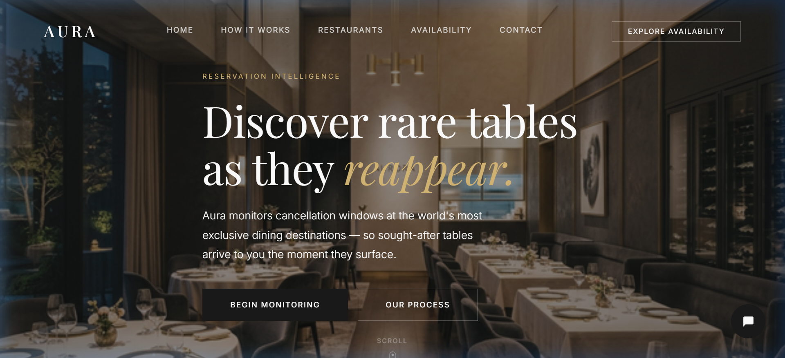
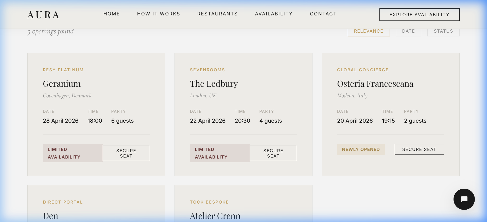
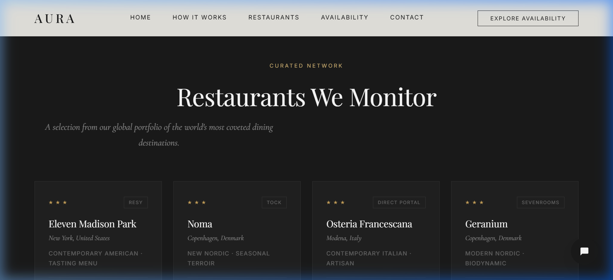
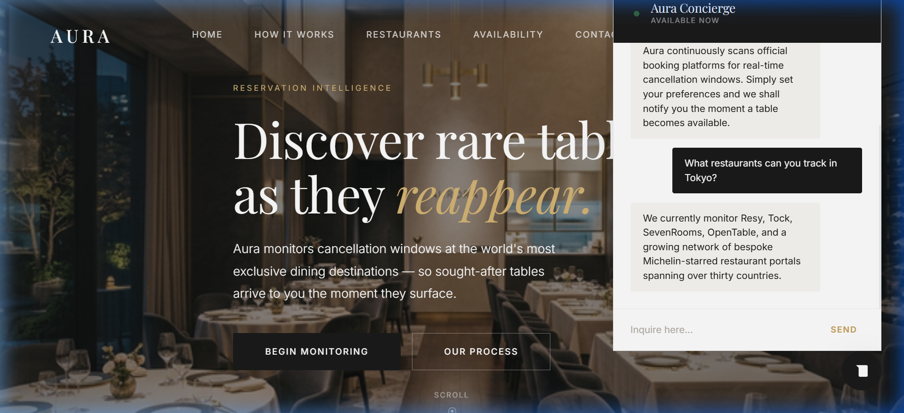

# ✨ Aura — Luxury Fine-Dining Reservation Monitoring

<p align="center">
  
</p>

A premium, editorial-quality web platform that monitors the world's most exclusive restaurant reservation platforms for cancellation openings. Built with **vanilla HTML, CSS, and JavaScript** — no frameworks.

   

---

## 🍽️ Overview

Aura helps users discover rare tables at Michelin-starred restaurants by monitoring reservation platforms for newly available slots caused by cancellations. The design language is inspired by the branding of elite fine-dining establishments — elegant, restrained, and luxurious.

<p align="center">
  
</p>

### Key Features

- **Reservation Search** — Simulated search interface with loading states and dynamic result cards
- **8 Curated Restaurants** — Eleven Madison Park, Noma, Osteria Francescana, Geranium, Atelier Crenn, Den, Le Bernardin, The Ledbury
- **AI Concierge Chatbot** — Powered by the Gemini API with multi-model fallback and elegant local responses
- **Premium Micro-Animations** — Scroll reveals, hover effects, Ken Burns hero zoom, live pulse indicators
- **Fully Responsive** — Desktop, tablet, and mobile layouts with a full-screen mobile navigation overlay

---

## 🎨 Design System

| Token | Value |
|-------|-------|
| **Primary Font** | Playfair Display (serif headings) |
| **Body Font** | Inter (sans-serif) |
| **Accent Font** | Cormorant Garamond (italic subtitles) |
| **Background** | Warm Ivory `#F9F7F2` |
| **Text** | Deep Charcoal `#1A1A1A` |
| **Accent** | Champagne Gold `#C5A059` |

<p align="center">
  
</p>

---

## 📁 Project Structure

```
ResSearch/
├── index.html      # Semantic HTML — all 9 sections + chatbot
├── style.css       # 700+ line luxury design system
├── script.js       # Gemini-powered chatbot, search simulation, animations
├── assets/
│   └── hero.png    # AI-generated luxury restaurant interior
└── README.md
```

---

## 🚀 Getting Started

1. **Clone the repository**
   ```bash
   git clone https://github.com/jonathandyou/ResSearch.git
   cd ResSearch
   ```

2. **Open locally**
   ```bash
   # Option A: Direct file
   open index.html

   # Option B: Local server (recommended)
   python -m http.server 8080
   ```

3. **Visit** `http://localhost:8080`

---

## 🤖 Chatbot Configuration

The Aura Concierge chatbot uses the **Google Gemini API** with a multi-model fallback chain:

<p align="center">
  
</p>

1. `gemini-2.0-flash` → `gemini-1.5-flash` → `gemini-pro`
2. Retries on 429 (rate limit) with a 1.5s delay
3. Falls back to curated local responses if all API calls fail

To use your own API key, update the `GEMINI_API_KEY` constant in `script.js`.

---

## 📋 Sections

| # | Section | Description |
|---|---------|-------------|
| 1 | **Header** | Sticky navigation with glassmorphism on scroll |
| 2 | **Hero** | Full-viewport with Ken Burns zoom animation |
| 3 | **How It Works** | 3-step process with connecting line |
| 4 | **Search** | Reservation search with simulated loading |
| 5 | **Results** | Dynamic cards with status badges and sort controls |
| 6 | **Restaurants** | 8 Michelin-starred establishments with platform badges |
| 7 | **Benefits** | Value proposition with editorial pull-quote |
| 8 | **Testimonials** | 3-column member testimonial cards |
| 9 | **Footer** | 4-column layout with navigation and legal links |
| — | **Chatbot** | Floating AI concierge with Gemini integration |

---

## 📄 License

This project is for educational and demonstration purposes.
